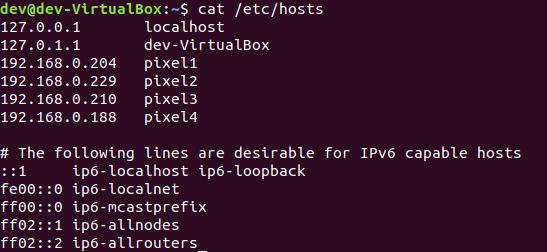

# Self-Driving Car Security Test Bed

## Steps to get started 

1. Install and set up a ROS environment
    
    Guide available [here](./ROS.md).

2. Install the custom streaming application on the phones. APK available here -> [app-debug.apk](./app-debug.apk)

3. Place all the packages in this repository in the `src` folder of your Catkin Workspace that was created in step 1. The packages that need to be in the `src` folder are:
	- facerec
    - imagerec
    - ipcamera_driver
    - velodyne
    - launchers
    - vision_opencv
    - but_calibration_camera_velodyne
    - perception_pcl
    - web-interface
    - but_velodyne_lib
    - pixor
    - web_video_server
    - camera_node
    - pointcloudprojection

4. Compile all the packages in the `src` folder using the command `catkin_make`.

5. Ensure the host computer is on the same network as the phones and the Velodyne LiDAR is connected to the host.

6. Add the IPs of the phones in `/etc/hosts` file of your Ubuntu installation, with the IPs labelled as `pixel1`, `pixel2`, `pixel3` and `pixel4`. Your `/etc/hosts` file should look like this:

 

7. Go the `src/web-interface/` folder inside the Catkin Workspace and run the following commands:
    - `npm install`
    - `npm start`

8. Confirm the LiDAR is connected by navigating to the URL - `http://192.168.1.201`

9. You should be able to navigate to the Web portal by the URL provided after step 6. 

10. Try running simulations using the Web Portal :) Choose a phone camera and click `Launch` to see video output.

